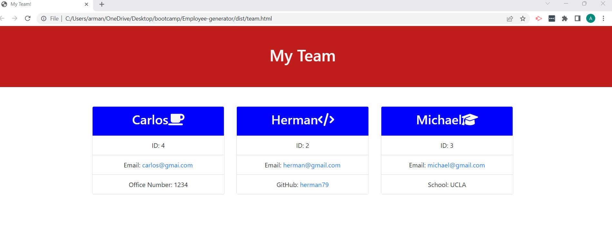

# Employee-generator

## Description

A short description explaining the what, why, and how of project "README-Generator":

 A Node.js command-line application that takes in information about employees on a software engineering team and generates an HTML webpage that displays summaries for each person. Includes unit tests for each part of the code to ensure that it passes all of them.

A walkthrough video that demonstrates its functionality and all of the tests passing is included with a link to the video of your project. 

## User Story

AS A manager

I WANT to generate a webpage that displays my team's basic info

SO THAT I have quick access to their emails and GitHub profile

## Acceptance Criteria

GIVEN a command-line application that accepts user input

WHEN I am prompted for my team members and their information

THEN an HTML file is generated that displays a nicely formatted team roster based on user input

WHEN I click on an email address in the HTML

THEN my default email program opens and populates the TO field of the email with the address

WHEN I click on the GitHub username

THEN that GitHub profile opens in a new tab

WHEN I start the application

THEN I am prompted to enter the team manager’s name, employee ID, email address, and office number

WHEN I enter the team manager’s name, employee ID, email address, and office number

THEN I am presented with a menu with the option to add an engineer or an intern or to finish building my team

WHEN I select the engineer option

THEN I am prompted to enter the engineer’s name, ID, email, and GitHub username, and I am taken back to the menu

WHEN I select the intern option

THEN I am prompted to enter the intern’s name, ID, email, and school, and I am taken back to the menu

WHEN I decide to finish building my team

THEN I exit the application, and the HTML is generated

## Installation

Pulling the GitHub repository from the follwing URL: https://github.com/RamRod79/README-Generator.git and typing the follwoing command ,'npm install', in the terminal will ensure the dependencies are installed and the program can run properly.

## Usage

## Credits

List of collaborators:

- UCLA Extension, Coding Bootcamp Instructor and TAs

## License

The following licenses have been used in the development of this project:

## Badges

## Repo Features

Using this repo can be initiated by running 'npm run Start' in the command terminal after opening the integrated terminal to initiate the program. Using this repo requires inquirer 8.2.4 or higher, and updated node modules to ensure application runs properly.

## How to Contribute

If other developers would like to contribute, you can contact me at armando.rod79@gmail.com.

## Tests

The tests are located in ./__tests __  and contains the following test files:

Employee.test.js

Engineer.test.js

Intern.test.js

Manager.test.js

## Contact Info

For any other issues or comments please contact me at:

GitHub username: RamRod79

Email: armando.rod79@gmail.com